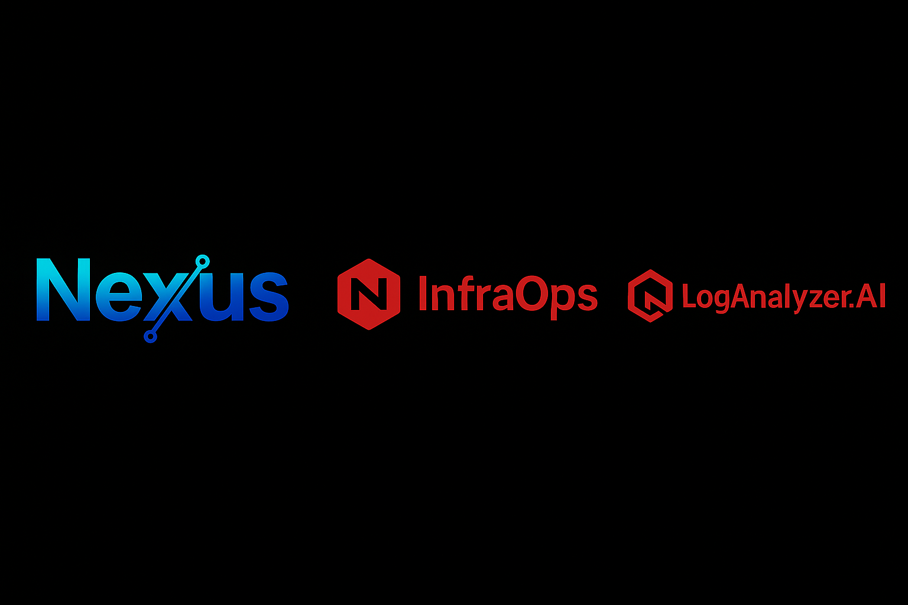
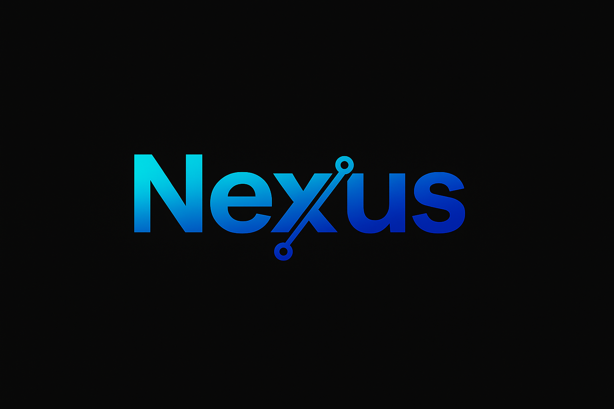
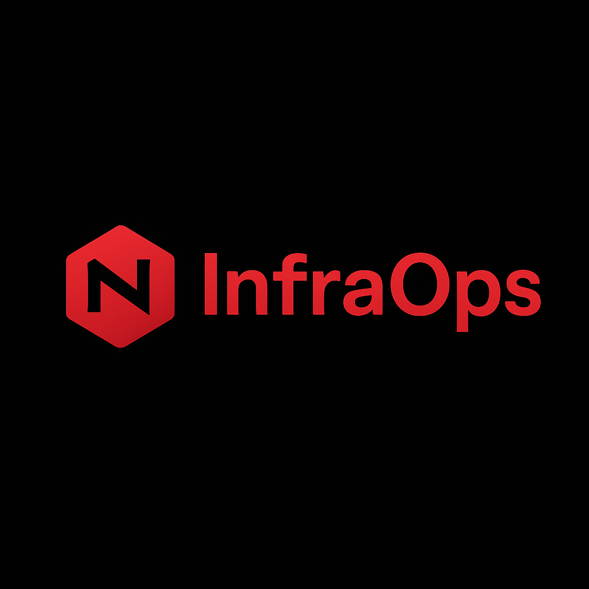
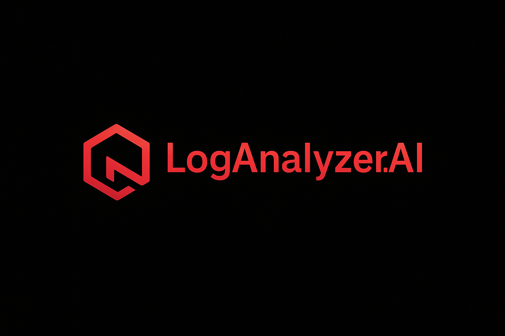

<!-- Repo Banner -->
<p align="center">
  
</p>

# nexus-secure-ai-engine


---

# Nexus — Secure. Scalable. Smart.

> **The AI debate engine that verifies answers before they reach you** — combining multiple AI models, real-time web context, and enterprise-grade encryption.

---

## Quick Snapshot
| Category       | Details |
|----------------|---------|
| **Status**     | Demonstrator — production-ready design, safe mode active |
| **Tech Stack** | Python 3.10+, Flask, Terraform |
| **Cloud Stack**| **AWS** (S3, RDS, DynamoDB, Glacier, ECS, KMS), **Azure** (Blob Storage, Key Vault, Cosmos DB, AKS), **GCP** (GCS, Cloud SQL/Spanner, BigQuery, GKE, KMS) |
| **Core Focus** | Secure AI aggregation, encrypted delivery, scalable multi-cloud architecture |
| **License**    | CC BY-NC 4.0 — Non-commercial use only without written consent |

---

## <br>What is Nexus.ai?
Nexus.ai is a **cloud-native AI orchestration platform** that:
- Gathers responses from **multiple AI models** (LLMs, proprietary models, and open-source).
- Is **Cloud Vendor Neutral** — AWS, Azure, GCP all supported.
- Enriches results with **real-time web context** from trusted sources.
- **Validates, ranks, and encrypts** before delivering to the user.

**In plain English:** Nexus is your **AI safety layer** — making answers **more accurate, secure, and trustworthy**.

---

## Why It’s Different
While most AI tools stop at *generating an answer*, Nexus:
1. Forces **multi-model debate** to eliminate bias and hallucinations.
2. Validates outputs against **live, verifiable context**.
3. Operates under **production-grade security constraints** from day one.
4. Functions in **safe demonstrator mode** with the ability to function in a live setting.
5. Is built for **modular enterprise adoption** — can slot into any internal ecosystem without vendor lock-in.

---

## Why It Matters
Without validation, AI can:
- Hallucinate facts.
- Miss critical updates.
- Leak sensitive information.
- Make critical errors that impact decision-making.

**Nexus fixes that** by:
- Cross-checking results across **multiple AI engines**, allowing them to debate cohesively.
- Adding **live web context** via scraping and search.
- Encrypting everything **end-to-end** with AES-256.
- Scaling to handle **millions of secure requests**.

---

## Core Features (With Impact)
- **Multi-Model AI Debate** — Balanced, bias-resistant answers.  
- **Live Web Context** — Relevant and up-to-date information.  
- **Encrypted by Default** — AES-256 protection prevents leaks.  
- **Smart Ranking Algorithms** — Filters noise, prioritizes truth.  
- **Cloud-Native & Multi-Cloud** — Works across AWS, Azure, and GCP seamlessly.  
- **Safe Demonstrator Mode** — No live API keys required but can be productionized instantly.  
- **Full Audit Trails** — Compliance-ready logging with TTL retention.  

---

## <br>InfraOps Companion (Coming Soon)
A **machine learning & LLM-enabled operations manager** for real-time infrastructure monitoring, automation, and observability.  
- Predictive anomaly detection  
- Auto-remediation workflows  
- Multi-cloud monitoring dashboard  
- SIEM integration ready  

InfraOps Companion delivers unified, multi-cloud observability and automation for infrastructure and development teams. It integrates seamlessly with Nexus or other AI-driven platforms, providing end-to-end visibility across AWS, Azure, and GCP environments. Designed for **large-scale, production-critical systems**, InfraOps Companion continuously monitors workflows for anomalies, performance degradation, and operational risks. It proactively surfaces root causes, recommends targeted resolutions, and enables automated remediation — preventing minor issues from escalating into major outages.

---

## <br>LogAnalyzer.AI (Coming Soon)
LogAnalyzer.AI is an **enterprise-grade, LLM-powered observability platform** for AI and multi-cloud environments. It transforms raw log data into actionable intelligence by enabling:
- Natural language log queries for rapid investigation without complex syntax
- Advanced pattern detection to identify AI hallucinations, drift, and anomalous behaviors
- Cross-platform API call trend analysis to reveal systemic issues before they impact production
- AI-assisted root cause insights that accelerate MTTR and prevent recurrence

Engineered for **scalability, security, and operational excellence**, LogAnalyzer.AI empowers engineering, SRE, and security teams to maintain trust, reliability, and peak performance in mission-critical AI workloads.

---

## System at a Glance  
**Design Principles:** **Safety • Scalability • Security**  

**Infrastructure Highlights:**  
- **Security:** AES-256 encryption, RBAC, multi-cloud KMS integration, network isolation, and full audit logging.  
- **Containerized Design:** Each tool operates independently or in integrated mode.  
- **Storage Tiers:**  
  - **Hot:** Object storage for real-time logs/backups, distributed NoSQL for instant lookups.  
  - **Warm:** Relational DBs for structured datasets and transactional operations.  
  - **Cold:** Archival storage for cost-optimized long-term retention.  
- **Compute:** Elastic container orchestration and scalable VM instances across AWS, Azure, and GCP.  
- **Observability:** Native cloud monitoring, automated snapshots, and tiered storage rollover across providers.  

---

## Security Model
- **No hardcoded secrets** — `.env` or secrets manager only.
- **Encrypted requests** — at rest and in transit.
- **API key scopes** — granular permissions per integration.
- **Attack resistance** — DoS protection, HTTPS enforcement.
- **Controlled logging** — Retained only as necessary.

---

## Author & Ownership
Designed, architected, and built end-to-end by **a single engineer** to demonstrate the ability to conceive, design, and implement production-ready, multi-cloud, AI-integrated systems with enterprise-grade security and scalability.

---

## Getting Started
```bash
# 1. Clone repository
git clone https://github.com/akshiththeindian/nexus.git
cd nexus

# 2. Install dependencies
pip install -r requirements.txt

# 3. Setup environment
cp .env.example .env
# Add your API keys or leave blank for demo mode

# 4. Run the app
python Nexus_FlaskApp.py
